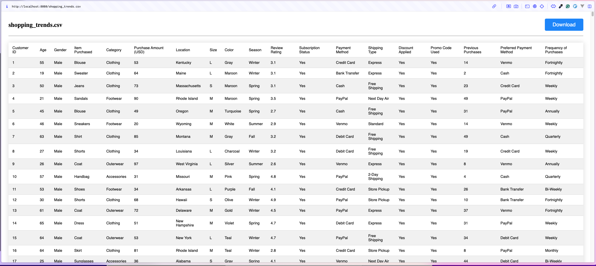

# **mod_csv_to_html**

`mod_csv_to_html` is an Apache HTTP server module that automatically renders CSV files as HTML tables. It simplifies presenting CSV data directly in the browser without requiring additional preprocessing.



---

## **Features**
- Automatically converts CSV files to HTML tables when accessed via the browser.
- Configurable to work with specific file extensions (e.g., `.csv`).
- Supports `,` and `;` delimiters
- Lightweight and efficient, designed for high performance.

---
## **Installation**
Ready to use module file can be founded at releases page :  https://github.com/nikopeikrishvili/apache_mod_csv_to_html/releases

---

## **Building from Source**
### Requirements
This module requires Apache 2.2 or 2.4 to be installed, including any corresponding "dev" package, such as apache2-dev on Ubuntu. You should have apxs your $PATH.


1. Clone the repository:
   ```bash
   https://github.com/nikopeikrishvili/apache_mod_csv_to_html.git
   cd apache_mod_csv_to_html
2. Build :
```bash
apxs -iac mod_csv_to_html.c csv_reader.c
```
3. Add module file to apache modules directory and run `a2enmod csv_to_html`
4. Add directive inside apache conf file or to virtualhost
```
<FilesMatch "\.csv$">
    SetHandler csv_to_html
</FilesMatch> 


```
---


